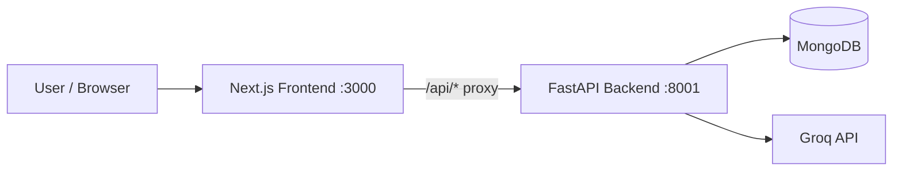
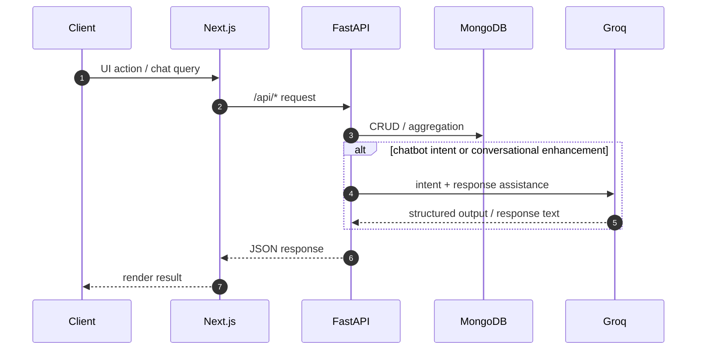
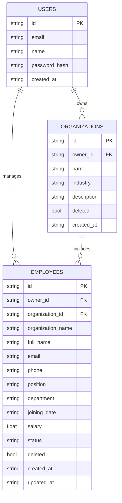

# Employee Management Backend


Backend service for an Employee Management System.  
It provides authentication, organization management, employee CRUD, analytics, and a context-aware HR chatbot.

## Project Description

This backend is built with FastAPI and MongoDB, and is designed to power a dashboard + chatbot workflow.

- User registration/login with JWT authentication
- Organization and employee lifecycle management
- Soft-delete + restore support
- Dashboard stats APIs (org-wise/dept-wise breakdowns)
- AI chatbot endpoint with context memory and org/employee analytics

## Tech Stack

- **Framework:** FastAPI
- **Runtime:** Python
- **Database:** MongoDB
- **Mongo Driver:** Motor (async)
- **Auth:** JWT (`python-jose`) + password hashing (`passlib`, `bcrypt`)
- **Validation:** Pydantic v2
- **AI Integration:** Groq API
- **Server:** Uvicorn

## System Architecture



## Request Workflow



## Prerequisites

- **Python:** 3.10 or higher
- **Node.js:** 18+ (required only if running frontend too)
- **npm/yarn:** for frontend run
- **MongoDB:** local or Atlas connection

## Installation Instructions

### 1. Backend Setup

```bash
cd backend
python -m venv venv
```

Windows:

```bash
.\venv\Scripts\activate
```

macOS/Linux:

```bash
source venv/bin/activate
```

Install dependencies:

```bash
pip install -r requirements.txt
```

### 2. Frontend Setup (Optional for full app run)

```bash
cd ../Maintonia
npm install
```

## How To Run The Project (Frontend + Backend)

### Run Backend

```bash
cd backend
uvicorn main:app --reload --host 0.0.0.0 --port 8001
```

### Run Frontend

```bash
cd Maintonia
npm run dev
```

Frontend runs on `http://localhost:3000`, backend on `http://localhost:8001`.

## Deploy On Render

This repo is now Render-ready with a root-level `render.yaml` that points to `backend/`.

### Option A: Blueprint Deploy (Recommended)

1. Push code to your GitHub repo.
2. In Render, click **New +** -> **Blueprint**.
3. Select your repo.
4. Render auto-detects `render.yaml` and creates the backend web service.
5. Add required environment variables in Render dashboard:
   - `MONGO_URL`
   - `DB_NAME`
   - `JWT_SECRET`
   - `GROQ_API_KEY` (optional)
6. Deploy.

### Option B: Manual Web Service

If you do not use Blueprint:

- **Runtime:** Python
- **Root Directory:** `backend`
- **Build Command:** `pip install -r requirements.txt`
- **Start Command:** `uvicorn main:app --host 0.0.0.0 --port $PORT`
- **Health Check Path:** `/api/health`

### Render Files Added

- `render.yaml` (at repo root)
- `backend/runtime.txt`
- `backend/.env.example`

## Environment Variables

Create `backend/.env`:

| Variable | Required | Description | Example |
|---|---|---|---|
| `MONGO_URL` | Yes | MongoDB connection string | `mongodb://localhost:27017` |
| `DB_NAME` | Yes | Database name | `employee_management` |
| `JWT_SECRET` | Yes | JWT signing secret | `change-this-secret` |
| `GROQ_API_KEY` | Optional\* | Required for chatbot AI features | `gsk_xxx` |

\* If `GROQ_API_KEY` is missing, chatbot advanced AI behavior may be limited/fallback.

## API Endpoints Documentation

Base URL: `http://localhost:8001`

### Health

| Method | Endpoint | Description | Auth |
|---|---|---|---|
| GET | `/api/health` | Service health check | No |

### Auth

| Method | Endpoint | Description | Auth |
|---|---|---|---|
| POST | `/api/auth/register` | Register user | No |
| POST | `/api/auth/login` | Login user | No |
| GET | `/api/auth/me` | Current user profile | Yes |

### Organizations

| Method | Endpoint | Description | Auth |
|---|---|---|---|
| GET | `/api/organizations` | List organizations | Yes |
| POST | `/api/organizations` | Create organization | Yes |
| DELETE | `/api/organizations/{org_id}` | Soft delete organization | Yes |

### Employees

| Method | Endpoint | Description | Auth |
|---|---|---|---|
| GET | `/api/employees` | List/filter/paginate employees | Yes |
| POST | `/api/employees` | Create employee | Yes |
| PUT | `/api/employees/{emp_id}` | Update employee | Yes |
| DELETE | `/api/employees/{emp_id}` | Soft delete employee | Yes |
| POST | `/api/employees/{emp_id}/restore` | Restore deleted employee | Yes |

### Analytics + Chatbot

| Method | Endpoint | Description | Auth |
|---|---|---|---|
| GET | `/api/stats` | Dashboard stats and distributions | Yes |
| POST | `/api/chatbot` | Context-aware HR assistant query | Yes |

## Screenshots (Add 3-4)

Add your screenshots under `backend/docs/screenshots/` and update links if needed.


## Database Schema

### Collections

- `users`
- `organizations`
- `employees`

### ER-Style Collection Relationship



### Model Relationship Notes

- One **User** can own many **Organizations**
- One **User** can manage many **Employees**
- One **Organization** can contain many **Employees**
- Employee docs denormalize `organization_name` for fast reads
- Soft-delete pattern is used (`deleted: true`) instead of hard deletion

## Notes

- Keep secrets out of commits (`.env` should not be pushed)
- Rotate JWT/Groq keys if exposed
- For production, restrict CORS and use managed secret storage

